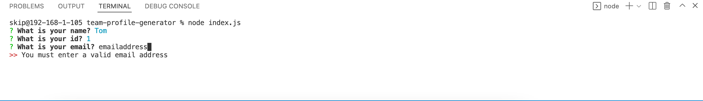
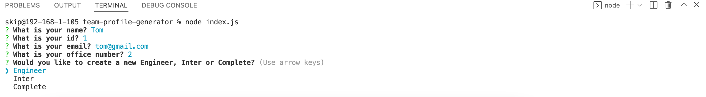
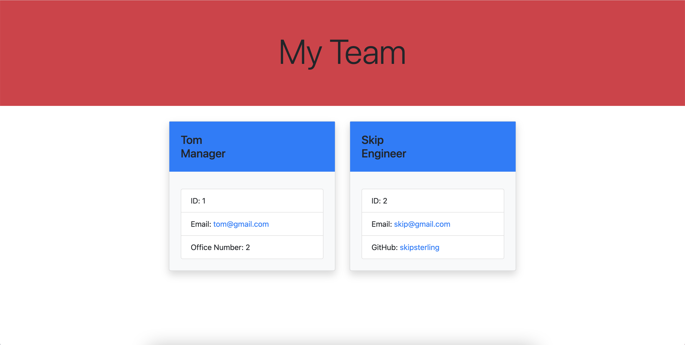

# team-profile-generator

## Description

The application I have created is for teams in their work place to add new users/ members to their team. There are some tests that are run to make sure that the new team members add the correct information in the submission form.
The team manager is added first then you can choose to add as many engineers or interns as you like. Once this is complete a html page is created which will display the relevant information.

## Install
To install you will need to use node.js So this will need to be installed for it to work. You can then clone the github repo in order to run this package. You must then run npm install so that all the dependancies are added for the app.

## Usage
To get started, open your command line and type node index.js

Next follow the questions / prompts. Be sure to answer correctly or you will be asked to try again and cannot progress.

Once all questions have been answered you will then be asked to either choose to add an engineer, an inter or if you would like to complete this process.

When you complete this process your html file will be created in the dist folder and your end result should look something like this. 

## Tests
To run tests simply go to the command line once all dependancies have been add by using npm install and type in npm test and you should have a screen that will tell you that all tests PASS.

## Walkthrough video
To watch how to use this application please watch this walkthrough video.

## Questions 
If you have any questions you can find my contact information through my github <a href="https://github.com/skipsterling">Thomas James</a>